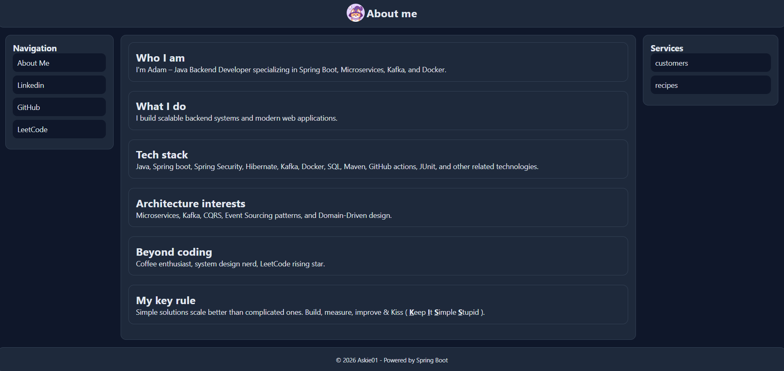

# 👋 About Me UI

A clean, modern, and lightweight personal profile web application built with 
**Spring Boot**, **Thymeleaf**, and custom CSS.

Designed as a simple yet polished “About Me” page, 
this project provides a structured UI with reusable layout fragments, static styling, 
and Docker-ready deployment.

---

## ✨ Features

- 🎨 **Custom responsive UI**
    - Organized CSS split into base, layout, and component styles
- 🧩 **Reusable Thymeleaf fragments**
    - Header
    - Footer
    - Sidebar
    - Right panel
- 📄 **Template-driven pages**
    - Clean page structure using a shared base layout
- 🖼️ **Profile image support**
    - Static image assets included under `resources/static/images`
- 🚀 **Spring Boot powered**
    - Simple application startup and MVC rendering
- 🐳 **Docker-ready**
    - Production-friendly container image using Eclipse Temurin Java 25 runtime

---

## 🛠️ Tech Stack

| Layer | Technology |
|---|---|
| Backend | Spring Boot |
| UI Rendering | Thymeleaf |
| Styling | HTML + CSS |
| Build Tool | Maven |
| Runtime | Java 25 |
| Containerization | Docker |

---

## 🚀 Getting Started

### Prerequisites

Make sure you have the following installed:

- **Java 25**
- **Maven** or the included Maven wrapper
- **Docker** optional, for containerized execution

---

## ▶️ Run Locally

Using the Maven wrapper:
```bash
./mvnw spring-boot:run
```

Then open your browser and visit:
http://localhost:8080

---

## 🧱 UI Architecture

The application separates page layout into reusable template fragments:

- `header.html` — top navigation or branding area
- `sidebar.html` — side navigation/profile section
- `right-panel.html` — supporting content area
- `footer.html` — footer content
- `base.html` — shared page shell
- `about.html` — main About Me page

CSS is also organized by responsibility:

- `base.css` — global defaults and resets
- `layout.css` — page structure and positioning
- `components.css` — reusable UI component styling

---

## 🎯 Purpose

This project is ideal for:

- A personal landing page
- A portfolio introduction screen
- A lightweight résumé-style profile
- A Spring Boot + Thymeleaf UI starter
- Practicing clean template composition

---

## 📸 Preview



---

## 🔧 Customization Ideas

You can easily personalize the app by updating:

- Profile image in `src/main/resources/static/images/profile.jpg`
- Page content in `src/main/resources/templates/pages/about.html`
- Layout fragments in `src/main/resources/templates/fragments`
- Styling in `src/main/resources/static/css`

---

## 🤝 Contributing

Contributions, ideas, and improvements are welcome.

If you want to enhance the design, add animations, improve responsiveness, 
or expand the page content, feel free to open a pull request.

---

## 📄 License

This project is licensed under the **MIT License**.

See the [LICENSE](LICENSE) file for details.

---

## 🌟 Final notes

**About Me UI** is a minimal but expressive personal web interface focused on 
clarity, structure, and easy customization.

Built with care using Spring Boot and Thymeleaf.